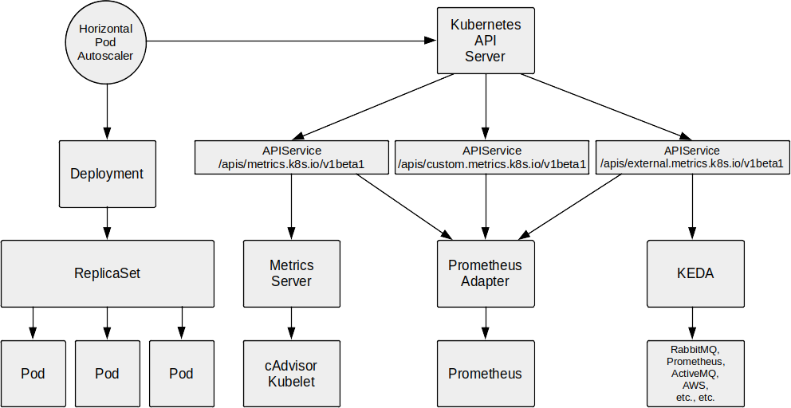

# Horizontal Pod Autoscaling
One of the major advantages of using Kubernetes for container orchestration is that it makes it easy to scale applications to account for increased resource usage.

In Kubernetes, a [Horizontal Pod Autoscaler](https://kubernetes.io/docs/tasks/run-application/horizontal-pod-autoscale/#support-for-custom-metrics) automatically updates a workload resource (such as a Deployment or StatefulSet), with the aim of automatically scaling the workload to match demand.

 

Horizontal scaling means that the response to increased load is to deploy more Pods. This is different from vertical scaling, which for Kubernetes would mean assigning more resources (for example: memory or CPU) to the Pods that are already running for the workload.

If the load decreases, and the number of Pods is above the configured minimum, the HorizontalPodAutoscaler instructs the workload resource (the Deployment, StatefulSet, or other similar resource) to scale back down.

## HPA Basics
Kubernetes implements HPA as a control loop that runs periodically with a default interval of 15 seconds. When run, the HPA controller queries the state of the cluster via the apiserver and applies changes attempting to move the current state towards the desired state.

The Horizontal Pod Autoscaler is configured to fetch metrics from aggregated Metrics APIs (`metrics.k8s.io`, `custom.metrics.k8s.io`, or `external.metrics.k8s.io`) and the HPA controller accesses corresponding workload resources that support scaling (such as Deployments and StatefulSet). These resources each have a sub-resource named `scale`, an interface that allows the number of replicas to be dynamically set and queried.

HPA doesn't work out of the box on Kubernetes and it is necessary to deploy an adapter that enables one or more of the `metrics.k8s.io`, `custom.metrics.k8s.io`, or `external.metrics.k8s.io` APIs. There are several adapters available that each enable different metrics APIs including: [Metrics Server](https://kubernetes.io/docs/tasks/debug/debug-cluster/resource-metrics-pipeline/#metrics-server) (`metrics.k8s.io`), [Prometheus Adapter](https://github.com/kubernetes-sigs/prometheus-adapter) (`metrics.k8s.io`, `custom.metrics.k8s.io`, and `external.metrics.k8s.io`)  and [KEDA](https://keda.sh/) (`external.metrics.k8s.io`).

The overall HPA architecture is:

 

## Resource Metrics and MetricsServer
Typically, Horizontal Pod Autoscalers scale Pods based on CPU or memory usage, these are known as _resource metrics_ obtained from the `metrics.k8s.io` endpoint. The `metrics.k8s.io` API is usually provided by a component named [Metrics Server](https://kubernetes.io/docs/tasks/debug/debug-cluster/resource-metrics-pipeline/#metrics-server) (available on [GitHub](https://github.com/kubernetes-sigs/metrics-server)).

If manually deploying the MetricsServer, the documentation says to deploy using the command:
```
kubectl apply -f https://github.com/kubernetes-sigs/metrics-server/releases/latest/download/components.yaml
```
However, that command doesn't work out of the box on some development/non-production Kubernetes distributions, including [kind](https://kind.sigs.k8s.io/), failing with:
```
Readiness probe failed: HTTP probe failed with statuscode: 500
```
This fails because kind doesn't provide proper certificates to Kubelet. To resolve the error the flag:
```
--kubelet-insecure-tls
```
needs to be added to `spec.containers.args` in the Deployment, e.g..
```
...
spec:
  containers:
  - args:
    - --cert-dir=/tmp
    - --secure-port=4443
    - --kubelet-preferred-address-types=InternalIP,ExternalIP,Hostname
    - --kubelet-use-node-status-port
    - --metric-resolution=15s
    - --kubelet-insecure-tls # Added to fix Readiness probe issue in kind cluster.
    image: registry.k8s.io/metrics-server/metrics-server:v0.6.4
...
```

For further background see: https://github.com/kubernetes-sigs/metrics-server/issues/917 and https://maggnus.com/install-metrics-server-on-the-kind-kubernetes-cluster-12b0a5faf94a

The [metrics-server.yaml](metrics-server.yaml) example in this repository incorporates this patch and MetricsServer may be manually installed via:
```
kubectl apply -f metrics-server.yaml
```
though the [cluster](cluster) script will install it automatically.

Deploying MetricsServer will create the `metrics.k8s.io` resource metrics APIService pointing to, in this case, the metrics-server Service.
```
apiVersion: apiregistration.k8s.io/v1
kind: APIService
metadata:
  labels:
    k8s-app: metrics-server
  name: v1beta1.metrics.k8s.io
spec:
  group: metrics.k8s.io
  groupPriorityMinimum: 100
  insecureSkipTLSVerify: true
  service:
    name: metrics-server
    namespace: kube-system
  version: v1beta1
  versionPriority: 100
```

To check if MetricsServer is deployed and working run:
```
kubectl get apiservices | grep metrics
```
which should include something similar to the following in its response:
```
v1beta1.metrics.k8s.io    kube-system/metrics-server    True
```
The following commands illustrate manually querying the resource metrics, with the `/nodes` and `/pods` API resources being the most useful
```
kubectl get --raw "/apis/metrics.k8s.io" | jq .
kubectl get --raw "/apis/metrics.k8s.io/v1beta1" | jq .
kubectl get --raw "/apis/metrics.k8s.io/v1beta1/nodes" | jq .
kubectl get --raw "/apis/metrics.k8s.io/v1beta1/pods" | jq .
```
The `kubectl top` [tool](https://kubernetes.io/docs/reference/kubectl/generated/kubectl_top/) leverages these metrics in a more intuitive and user friendly way, some example usage of this command is:
```
kubectl top node
kubectl top pod -A
kubectl top pod -n monitoring
```
To use HPA resource metrics to scale a Deployment based on CPU or memory usage a [HorizontalPodAutoscaler Object](https://kubernetes.io/docs/reference/generated/kubernetes-api/v1.30/#horizontalpodautoscaler-v2-autoscaling) needs to be created:

```
kind: HorizontalPodAutoscaler
apiVersion: autoscaling/v2
metadata:
  name: resource-metric-hpa-example
spec:
  scaleTargetRef:
    kind: Deployment
    apiVersion: apps/v1
    # Use the actual name of the target Deployment to be scaled
    # for the value of the name field below.
    name: target-deployment
  minReplicas: 1
  maxReplicas: 50
  metrics:
  - type: Resource
    resource:
      metric:
        name: cpu
      target:
        type: Utilization
        averageUtilization: 60
```
For per-Pod resource metrics (like CPU), the controller fetches the metrics from the resource metrics API for each Pod targeted by the HorizontalPodAutoscaler. Then, if a target utilization value is set, the controller calculates the utilization value as a percentage of the equivalent resource request on the containers in each Pod. If a target raw value is set, the raw metric values are used directly. The controller then takes the mean of the utilization or the raw value (depending on the type of target specified) across all targeted Pods, and produces a ratio used to scale the number of desired replicas.

## Prometheus Adapter
Although scaling Pods based on CPU or memory usage is a really common use case, it is only really useful for applications that are CPU (or memory) bound. For applications that may be I/O bound this is unlikely to be useful, so we might be better scaling on other metrics like API invocation requests per second, queue depth, etc. which a metrics service like Prometheus might already be scraping.

[Prometheus Adapter](https://github.com/kubernetes-sigs/prometheus-adapter) helps us to leverage the metrics collected by Prometheus and use them to make scaling decisions by providing an implementation of the Kubernetes resource, custom and external metrics APIs (`metrics.k8s.io`, `custom.metrics.k8s.io`, or `external.metrics.k8s.io`). Because it implements `metrics.k8s.io` Prometheus Adapter can, when properly configured, replace MetricsServer, though MetricsServer is likely the simpler option if only resource metrics are required.

#### Deploy Prometheus
In order to use Prometheus Adapter it is obviously necessary for Prometheus to be deployed in the Kubernetes cluster. There are several ways to achieve this including the [Prometheus Operator](https://github.com/prometheus-operator/kube-prometheus) or [Helm Chart](https://github.com/prometheus-community/helm-charts), but it can often be more instructive to manually deploy. This blog https://se7entyse7en.dev/posts/how-to-set-up-kubernetes-service-discovery-in-prometheus/ is quite comprehensive and the [prometheus.yaml](prometheus.yaml) manifest used in this example repository is based on that blog post.

In this example we want to configure Prometheus to collect metrics from Kubernetes Pods that have following three annotations:
```
prometheus.io/scrape: true
prometheus.io/path: <metric path>
prometheus.io/port: <port>
```
[To do this for RabbitMQ](https://github.com/rabbitmq/rabbitmq-server/blob/main/deps/rabbitmq_prometheus/README.md) we need to set up our RabbitMQ ConfgMap to enable the `rabbitmq_prometheus` plugin:
```
  enabled_plugins: |
    [rabbitmq_management,rabbitmq_prometheus].
```
and modify rabbitmq.conf in the ConfigMap to configure the port and per object metrics.
```
prometheus.return_per_object_metrics = true
prometheus.tcp.port = 15692 # Default value
```
and add the Prometheus annotations mentioned earlier to the Deployment:
```
...
template:
  metadata:
    labels:
      app.kubernetes.io/name: rabbitmq
    annotations:
      prometheus.io/port: "15692"
      prometheus.io/scrape: "true"
      #prometheus.io/path: "/metrics"
  spec:
    volumes:
...
```
To see this in context the [rabbitmq.yaml](rabbitmq.yaml) manifest used in this example repository already has these configured.

For Prometheus to be able to use these annotations, a [scrape_config](https://github.com/appscode/third-party-tools/blob/master/monitoring/prometheus/builtin/README.md#scrape_config-configuration) needs to be set up in the Prometheus configuration (which has already been done in our [prometheus.yml](prometheus.yml) manifest).
```
- job_name: 'kubernetes-pods'
  kubernetes_sd_configs:
  - role: pod
  relabel_configs:
  # Select only those pods that have "prometheus.io/scrape: true" annotation
  - source_labels: [__meta_kubernetes_pod_annotation_prometheus_io_scrape]
    action: keep
    regex: true
    # Set metrics_path (default is /metrics) to the metrics path specified in "prometheus.io/path: <metric path>" annotation.
  - source_labels: [__meta_kubernetes_pod_annotation_prometheus_io_path]
    action: replace
    target_label: __metrics_path__
    regex: (.+)
    # Set the scraping port to the port specified in "prometheus.io/port: <port>" annotation and set address accordingly.
  - source_labels: [__address__, __meta_kubernetes_pod_annotation_prometheus_io_port]
    action: replace
    regex: ([^:]+)(?::\d+)?;(\d+)
    replacement: $1:$2
    target_label: __address__
  - action: labelmap
    regex: __meta_kubernetes_pod_label_(.+)
  - source_labels: [__meta_kubernetes_namespace]
    action: replace
    target_label: kubernetes_namespace
  - source_labels: [__meta_kubernetes_pod_name]
    action: replace
    target_label: kubernetes_pod_name
```
As mentioned earlier Prometheus Adapter can be configured to replace MetricsServer, which requires a scrape_config job to be set up to scrape node resource metrics, again this has already been done in our [prometheus.yml](prometheus.yml) manifest:
```
- job_name: 'kubernetes-nodes'
  scheme: https
  tls_config:
    ca_file: /var/run/secrets/kubernetes.io/serviceaccount/ca.crt
  bearer_token_file: /var/run/secrets/kubernetes.io/serviceaccount/token
  kubernetes_sd_configs:
  - role: node
  relabel_configs:
  - action: labelmap
    regex: __meta_kubernetes_node_label_(.+)
  - target_label: __address__
    replacement: kubernetes.default.svc:443
  - source_labels: [__meta_kubernetes_node_name]
    regex: (.+)
    target_label: __metrics_path__
    replacement: /api/v1/nodes/${1}/proxy/metrics/resource
```

#### Deploy Prometheus Adapter
With Prometheus installed we can finally turn our attention to Prometheus Adapter. There is a [Helm Chart](https://github.com/prometheus-community/helm-charts/tree/main/charts/prometheus-adapter) available, but our [prometheus-adapter.yaml](prometheus-adapter.yaml) manifest used in this example repository is based on the deployment [manifests](https://github.com/kubernetes-sigs/prometheus-adapter/tree/master/deploy/manifests) from the Prometheus Adapter [GitHub repository](https://github.com/kubernetes-sigs/prometheus-adapter).

Most of the sections in our prometheus-adapter.yaml are taken directly from the manifests in the Prometheus Adapter GitHub repository, with the main difference being the ConfigMap section.

[Configuring Prometheus Adapter](https://github.com/kubernetes-sigs/prometheus-adapter/blob/master/docs/config.md) can be [quite complicated](https://github.com/kubernetes-sigs/prometheus-adapter/blob/master/docs/walkthrough.md). The simplest case is configuring `resourceRules` so that Prometheus Adapter can expose resource metrics as a replacement for MetricsServer. **Note** that the [prometheus-adapter.yaml](prometheus-adapter.yaml) manifest contains APIService manifests for `metrics.k8s.io`, `custom.metrics.k8s.io` and `external.metrics.k8s.io` so it is important not to deploy both Prometheus Adapter and MetricsServer as the `metrics.k8s.io` APIService in prometheus-adapter.yaml will conflict with that in metrics-server.yaml.

#### Configure Prometheus Adapter Resource Metrics
The `resourceRules` needed to expose CPU and memory metrics are:
```
resourceRules:
  cpu:
    containerLabel: container
    containerQuery: |
      sum by (<<.GroupBy>>) (
        irate (
            container_cpu_usage_seconds_total{<<.LabelMatchers>>,container!="",pod!=""}[4m]
        )
      )
    nodeQuery: |
      sum by (<<.GroupBy>>) (
        irate(
            node_cpu_usage_seconds_total{<<.LabelMatchers>>}[4m]
        )
      )
    resources:
      overrides:
        namespace:
           resource: namespace
        #node:
        instance:
          resource: node
        pod:
          resource: pod
  memory:
    containerLabel: container
    containerQuery: |
      sum by (<<.GroupBy>>) (
        container_memory_working_set_bytes{<<.LabelMatchers>>,container!="",pod!=""}
      )
    nodeQuery: |
      sum by (<<.GroupBy>>) (
        node_memory_working_set_bytes{<<.LabelMatchers>>}
      )
    resources:
      overrides:
        namespace:
          resource: namespace
        #node:
        instance:
          resource: node
        pod:
          resource: pod
  window: 5m
```
To check if Prometheus Adapter is deployed and working run:
```
kubectl get apiservices | grep metrics
```
which should show the metrics, custom and external metrics APIs deployed in its response:
```
v1beta1.custom.metrics.k8s.io    monitoring/prometheus-adapter  True
v1beta1.external.metrics.k8s.io  monitoring/prometheus-adapter  True
v1beta1.metrics.k8s.io           monitoring/prometheus-adapter  True
```
As with MetricsServer the following commands illustrate manually querying the resource metrics, with the `/nodes` and `/pods` API resources being the most useful
```
kubectl get --raw "/apis/metrics.k8s.io" | jq .
kubectl get --raw "/apis/metrics.k8s.io/v1beta1" | jq .
kubectl get --raw "/apis/metrics.k8s.io/v1beta1/nodes" | jq .
kubectl get --raw "/apis/metrics.k8s.io/v1beta1/pods" | jq .
```
The `kubectl top` [tool](https://kubernetes.io/docs/reference/kubectl/generated/kubectl_top/) leverages these metrics in a more intuitive and user friendly way, some example usage of this command is:
```
kubectl top node
kubectl top pod -A
kubectl top pod -n monitoring
```
Using only resource metrics, however, leaves us no better off than using MetricsServer, but with a lot more complexity required. In our case in order to deal with more I/O bound resources we want to scale based on RabbitMQ queue depth and for that we need to use either custom or external metrics.

#### Configure Prometheus Adapter Custom Metrics
For our initial attempt at using custom metrics, we configure each RabbitMQ queue in the Prometheus Adapter config.yaml as a separate named rule, e.g. in this case we have example queues named task_queue and test_queue.
```
rules:
- seriesQuery: 'rabbitmq_queue_messages{app_kubernetes_io_name!="",kubernetes_namespace!=""}'
  resources:
    overrides:
      kubernetes_namespace: {resource: "namespace"}
      app_kubernetes_io_name: {resource: "service"}
  metricsQuery: 'sum(<<.Series>>{<<.LabelMatchers>>,queue="task_queue"}) by (<<.GroupBy>>)'
  name:
    as: "task_queue"
- seriesQuery: 'rabbitmq_queue_messages{app_kubernetes_io_name!="",kubernetes_namespace!=""}'
  resources:
    overrides:
      kubernetes_namespace: {resource: "namespace"}
      app_kubernetes_io_name: {resource: "service"}
  metricsQuery: 'sum(<<.Series>>{<<.LabelMatchers>>,queue="test_queue"}) by (<<.GroupBy>>)'
  name:
    as: "test_queue"
```
When deployed they may be queried in the appropriate namespace and service (e.g. the namespace and service of the RabbitMQ Service) by name.
```
kubectl get --raw "/apis/custom.metrics.k8s.io/v1beta1/namespaces/messaging/services/rabbitmq/test_queue" | jq .
kubectl get --raw "/apis/custom.metrics.k8s.io/v1beta1/namespaces/messaging/services/rabbitmq/task_queue" | jq .
```
This approach works, but it is very inflexible, as each queue we wish to scale on requires its own rule in the Prometheus Adapter configuration, which is fine for a static topology but very inconvenient for a more dynamic topology.

For a more flexible approach we can do a more general query of rabbitmq_queue_messages and refine it using a label selector:
```
rules:
- seriesQuery: 'rabbitmq_queue_messages{app_kubernetes_io_name!="",kubernetes_namespace!=""}'
  resources:
    overrides:
      kubernetes_namespace: {resource: "namespace"}
      app_kubernetes_io_name: {resource: "service"}
  metricsQuery: 'sum(<<.Series>>{<<.LabelMatchers>>}) by (<<.GroupBy>>)'
```
In this case the queries look like:
```
kubectl get --raw "/apis/custom.metrics.k8s.io/v1beta1/namespaces/messaging/services/rabbitmq/rabbitmq_queue_messages?metricLabelSelector=queue%3Dtest_queue" | jq .
```
for the test_queue, and for task_queue:
```
kubectl get --raw "/apis/custom.metrics.k8s.io/v1beta1/namespaces/messaging/services/rabbitmq/rabbitmq_queue_messages?metricLabelSelector=queue%3Dtask_queue" | jq .
```
Note the use of metricLabelSelector in those queries.

Using this more general Prometheus Adapter configuration, a HorizontalPodAutoscaler configuration for a queue named  "echo-lambda" scaling the  echo-lambda Deployment would look like:
```
kind: HorizontalPodAutoscaler
apiVersion: autoscaling/v2
metadata:
  name: echo-lambda-hpa
  namespace: messaging
spec:
  scaleTargetRef:
    kind: Deployment
    apiVersion: apps/v1
    name: echo-lambda
  minReplicas: 1
  maxReplicas: 50
  metrics:
  - type: Object
    object:
      metric:
        name: rabbitmq_queue_messages
        selector: 
          matchLabels:
            "queue": "echo-lambda"
      describedObject:
        kind: Service
        apiVersion: "v1"
        name: rabbitmq
      target:
        type: AverageValue
        averageValue: 100
```
This is nearly, but not quite, what we'd like. One further issue is that, because queue depth metrics from RabbitMQ are really a _proxy_ for the actual resource being monitored, ideally we'd like HPA to be able to query metrics in a different namespace than the resource being controlled by the HPA. In this case the Deployment being controlled has to be in the same namespace as our RabbitMQ, in this case messaging, which is very inconvenient. The only way to achieve this is to use external metrics instead of custom metrics.

#### Configure Prometheus Adapter External Metrics
To use external metrics with a wildcarded namespace we configure Prometheus Adapter config.yaml as follows:
```
externalRules:
- seriesQuery: 'rabbitmq_queue_messages'
  resources:
    namespaced: false
  metricsQuery: 'sum(<<.Series>>{<<.LabelMatchers>>}) by (<<.GroupBy>>)'
```
With namespaced: false set in the externalRules, to get the external metrics value for test_queue the query looks like:
```
kubectl get --raw "/apis/external.metrics.k8s.io/v1beta1/namespaces/*/rabbitmq_queue_messages?labelSelector=queue%test_queue" | jq .
```
Note the use of labelSelector here for the query, whereas custom metrics used metricLabelSelector.

Using this Prometheus Adapter configuration for external metrics, a HorizontalPodAutoscaler configuration for a queue named  "echo-lambda" scaling the  echo-lambda Deployment would look like:
```
kind: HorizontalPodAutoscaler
apiVersion: autoscaling/v2
metadata:
  name: echo-lambda-hpa
  namespace: lambda
spec:
  scaleTargetRef:
    kind: Deployment
    apiVersion: apps/v1
    name: echo-lambda
  minReplicas: 1
  maxReplicas: 50
  metrics:
  - type: External
    external:
      metric:
        name: rabbitmq_queue_messages
        selector: 
          matchLabels:
            "kubernetes_namespace": "messaging"
            "queue": "echo-lambda"
      target:
        type: AverageValue
        averageValue: 100
```
Here the Deployment being scaled is in the "lambda" namespace, as we would like, and we use an external metric with a matchLabel specifying the queue and the namespace the metric is from (in this case "messaging").

The [lambdas-hpa.yaml](lambdas-hpa.yaml) manifest contains a complete example of Deployments and their associated HorizontalPodAutoscalers using external Prometheus RabbitMQ metrics.

## KEDA
Although Prometheus Adapter works well and provides a good way to explore the full range of Kubernetes metrics APIs it can be quite complicated to set up.

A more recent alternative Kubernetes metrics adapter is [KEDA](https://keda.sh/), which arguably provides a much simpler way to scale Kubernetes resources from a wide range of metrics.

KEDA has a wide range of built-in [scalers](https://keda.sh/docs/2.14/scalers/) (currently over 64) including native RabbitMQ, ActiveMQ, various AWS, GCP and Azure services, etc., etc. KEDA also has its own Prometheus scaler that may be used where a native scaler isn't available but Prometheus metrics are.

Deploying KEDA is simple and the [documentation](https://keda.sh/docs/2.14/deploy/) provides instructions for [Helm Charts](https://keda.sh/docs/2.14/deploy/#helm), [Operator Hub](https://keda.sh/docs/2.14/deploy/#operatorhub) and [yaml manifests](https://keda.sh/docs/2.14/deploy/#yaml). Deploying using the yaml manifest is simply:
```
kubectl apply --server-side -f https://github.com/kedacore/keda/releases/download/v2.14.0/keda-2.14.0.yaml
```
This repository contains a downloaded copy of that manifest [keda-2.14.0.yaml](keda-2.14.0.yaml), so we may do:
```
kubectl apply --server-side -f keda-2.14.0.yaml
```
Note that the `--server-side` option is needed because the ScaledJob CRD is too long to process, see [this issue](https://github.com/kedacore/keda/issues/4740) for details.

To check if KEDA is deployed and working run:
```
kubectl get apiservices | grep metrics
```
which should show the external metrics API deployed in its response:
```
v1beta1.external.metrics.k8s.io  keda/keda-metrics-apiserver  True
```

#### KEDA Scaling with Native RabbitMQ Scaler
KEDA has the idea of [ScaledObjects](https://keda.sh/docs/2.14/concepts/scaling-deployments/), which create and configure HorizontalPodAutoscalers behind the scenes. ScaledObjects contain triggers, in our case the [rabbitmq trigger](https://keda.sh/docs/2.14/scalers/rabbitmq-queue/).
```
apiVersion: keda.sh/v1alpha1
kind: ScaledObject
metadata:
  name: echo-lambda
  namespace: lambda
  #annotations:
  #  scaledobject.keda.sh/transfer-hpa-ownership: "true"     # Optional. Use to transfer an existing HPA ownership to this ScaledObject
  #  autoscaling.keda.sh/paused-replicas: "0" # Optional. Pause autoscaling
  #  autoscaling.keda.sh/paused: "true"       # Optional. Pause autoscaling explicitly
spec:
  scaleTargetRef:
    kind: Deployment    # Optional. Default: Deployment
    apiVersion: apps/v1 # Optional. Default: apps/v1
    name: echo-lambda   # Mandatory. Must be in the same namespace as the ScaledObject
    #envSourceContainerName: echo-lambda # Optional. Default: .spec.template.spec.containers[0]
  pollingInterval:  2   # Optional. Default: 30 seconds
  cooldownPeriod:   10  # Optional. Default: 300 seconds
  #idleReplicaCount: 0   # Optional. Default: ignored, must be less than 
  minReplicaCount:  1   # Optional. Default: 0
  maxReplicaCount:  50 # Optional. Default: 100
  #fallback:             # Optional. Section to specify fallback options
  #  failureThreshold: 3 # Mandatory if fallback section is included
  #  replicas: 6         # Mandatory if fallback section is included
  #advanced:             # Optional. Section to specify advanced options
  #  restoreToOriginalReplicaCount: false # Optional. Default: false
  #  horizontalPodAutoscalerConfig: # Optional. Section to specify HPA related options
  #    name: keda-hpa-echo-lambda   # Optional. Default: keda-hpa-{scaled-object-name}
  #    behavior:                    # Optional. Use to modify HPA's scaling behavior
  #      scaleDown:
  #        stabilizationWindowSeconds: 300
  #        policies:
  #        - type: Percent
  #          value: 100
  #          periodSeconds: 15
  triggers:
  - type: rabbitmq
    metadata:
      #host: amqp://rabbitmq.messaging:5672 # Optional. If not specified, it must be done by using TriggerAuthentication or hostFromEnv.
      protocol: auto # Optional, amqp, http, or auto (default) to autodetect from `host` value.
      mode: QueueLength # QueueLength or MessageRate
      value: "100" # message backlog or publish/sec. target per instance
      #activationValue: "0" # Optional. Activation threshold
      queueName: echo-lambda
      #vhostName: / # Optional. If not specified, use the vhost in the `host` connection string. Required for Azure AD Workload Identity authorization.
      # Alternatively, you can use existing environment variables to read configuration from:
      # See details in "Parameter list" section
      hostFromEnv: AMQP_URI # Optional. Alternative to `host` parameter
      unsafeSsl: "true"
```
Note that in this ScaledObject we set minReplicaCount to 1 because although KEDA can scale to zero, the default behaviour of lambda-runtime-api-daemon us to autodelete the AMQP queue that maps to the function name. If the queue is deleted then the metric KEDA uses to scale back up won't be available.

The [lambdas-keda.yaml](lambdas-keda.yaml) manifest contains a complete example of Deployments and their associated ScaledObjects using the native rabbitmq trigger, and it is this example that is deployed by default by the [cluster](cluster) script at startup.

#### KEDA Scaling with Prometheus Scaler and RabbitMQ Metrics
Although _intuitively_ it makes sense to use KEDA's _native_ scalers, in many real-world systems Prometheus is already installed and scraping metrics from components and the KEDA scaler would represent additional polling/querying of those components. In most cases the additional cost of scaler querying is small, but it is something to be mindful of.

One interesting case is using KEDA to scale on HTTP requests-per-second, where the KEDA [http-add-on](https://github.com/kedacore/http-add-on) would seem to be the obvious choice. However, if one examines the [architecture](https://github.com/kedacore/http-add-on/blob/main/docs/design.md) of that, the Interceptor component is basically a transparent HTTP proxy that collects metrics then forwards the requests. In practice, however, it is very likely that the Ingress is likely to use something like nginx. So Prometheus scraping the nginx metrics is likely to be much more efficient than an additional layer of proxying, especially because in a real-world system those metrics are already likely being scraped by Prometheus.

For completeness, this ScaledObject uses the KEDA [prometheus trigger](https://keda.sh/docs/2.14/scalers/prometheus/) to scale on the `rabbitmq_queue_messages` metric, which is somewhat equivalent to the Prometheus Adapter approach.
```
apiVersion: keda.sh/v1alpha1
kind: ScaledObject
metadata:
  name: echo-lambda
  namespace: lambda
spec:
  scaleTargetRef:
    kind: Deployment
    apiVersion: apps/v1
    name: echo-lambda
  pollingInterval:  2
  cooldownPeriod:   10
  #idleReplicaCount: 0
  minReplicaCount:  1
  maxReplicaCount:  50
  triggers:
  - type: prometheus
    metadata:
      # Required fields:
      serverAddress: http://prometheus.monitoring.svc:9090
      # Note: query must return a vector/scalar single element response
      query: sum(rabbitmq_queue_messages{queue="echo-lambda"})
      #query: sum(rate(http_requests_total{deployment="my-deployment"}[2m]))
      threshold: "100" # message backlog target per instance
      #activationThreshold: "0" # Optional. Activation threshold
      # Optional fields:
      #namespace: example-namespace  # for namespaced queries, eg. Thanos
      #customHeaders: X-Client-Id=cid,X-Tenant-Id=tid,X-Organization-Id=oid # Optional. Custom headers to include in query. In case of auth header, use the custom authentication or relevant authModes.
      #ignoreNullValues: true # Default is `true`, which means ignoring the empty value list from Prometheus. Set to `false` the scaler will return error when Prometheus target is lost
      unsafeSsl: "true"
```
The [lambdas-keda-prometheus-trigger.yaml](lambdas-keda-prometheus-trigger.yaml) manifest contains a complete example of Deployments and their associated ScaledObjects using the Prometheus trigger and RabbitMQ metrics.
