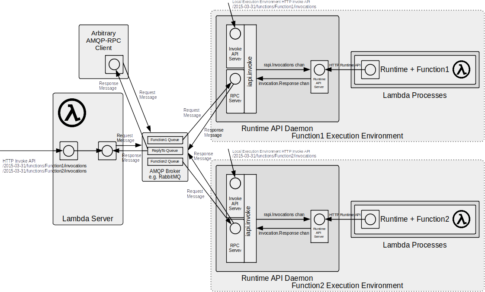

# kind-lambda
One of the most useful ways of using the Lambda Runtime API Daemon is by deploying Lambdas to Kubernetes in conjunction with the Lambda Server to act as a local Lambda Service.

 

With this approach the Lambda Server performs a somewhat similar role to the Lambda Service Invoke API, where it acts as an [Invoke API](https://docs.aws.amazon.com/lambda/latest/dg/API_Invoke.html) endpoint and routes requests to each invoked Function via [AMQP-RPC](https://www.rabbitmq.com/tutorials/tutorial-six-python.html).

AMQP-RPC is used as the Invocation API back-end transport where the routing is performed entirely by the AMQP broker (e.g. RabbitMQ). With AMQP-RPC invocations the FunctionNames correspond to AMQP queues and the AMQP request messages simply specify the FunctionName as the AMQP Routing Key when publishing the message to the default direct exchange, which in turn will deliver the message to the appropriate queue. For the case of the HTTP [Invoke API](https://docs.aws.amazon.com/lambda/latest/dg/API_Invoke.html) the Lambda Server component simply behaves as an HTTP to AMQP proxy and will extract the FunctionName from the HTTP request URI and publish the request as an AMQP message using the extracted FunctionName as the Routing Key.

Using a messaging service like AMQP as a "Function router" offers a number of advantages, including being relatively "transparent" as it requires no registration mechanism. When a Function is deployed it declares a queue with the broker if one doesn't already exist and multiple instances can share a queue for simple load balancing. Using a messaging service also provides a degree of elastic request buffering and provides the queueing needed by [asynchronous Lambda invocations](https://docs.aws.amazon.com/lambda/latest/dg/invocation-async.html).

In this model the Lambda Runtime API Daemon acts as PID 1 for Lambda Execution Environments that are unmodified Lambda Container Images deployed as Kubernetes Deployments, using [init Containers](https://kubernetes.io/docs/concepts/workloads/pods/init-containers/) to "inject" the Lambda Runtime API Daemon executable into the Lambda Container as a Volume mount.

This example illustrates standing up a Kubernetes cluster using [kind](https://kind.sigs.k8s.io/), which is a tool for running local Kubernetes multi-node clusters using Docker containers as nodes. The cluster has the Kubernetes Dashboard, RabbitMQ, Prometheus, and a simple (insecure) local container registry deployed, so the example is standalone with few additional dependencies.

With the cluster deployed the example goes on to illustrate deploying the Lambda Server and [echo/echo-lambda](../../echo/echo-lambda) and [wasm/image-greyscale](../../wasm/image-greyscale) example Lambdas as Lambda Container Images deployed as Kubernetes Deployments employing [Horizontal Pod Autoscaling](HPA.md) using either [KEDA](https://github.com/kedacore/keda) or [Prometheus Adapter](https://github.com/kubernetes-sigs/prometheus-adapter).

## Prerequisites
In addition to Docker this example requires a few CLIs to be installed and available on the user's PATH.

**kind**
https://kind.sigs.k8s.io/docs/user/quick-start#installation
```
curl -Lo ./kind https://kind.sigs.k8s.io/dl/v0.20.0/kind-linux-amd64
chmod +x ./kind

# mv to /usr/local/bin or other directory on PATH
sudo mv ./kind /usr/local/bin/kind
```

**kubectl**
https://kubernetes.io/docs/tasks/tools/install-kubectl-linux/

This downloads kubectl v1.27.3 to be consistent with the Kubernetes version deployed with kind v0.20.0. If a different release of kind is deployed the kubectl version may need to be modified to remain consistent.
```
curl -LO https://dl.k8s.io/release/v1.27.3/bin/linux/amd64/kubectl
chmod +x ./kubectl

# mv to /usr/local/bin or other directory on PATH
sudo mv ./kubectl /usr/local/bin/kubectl
```

## Build and Tag Lambda Server & RAPID
To build the Lambda Runtime API Daemon and Lambda Server images navigate to the root directory of the [lambda-runtime-api-daemon](../../../)  repository and run:
```
make docker
```
For the Docker based build this will create `lambda-runtime-api-daemon` and `lambda-server` Docker images locally.

To use these images in our example cluster we need to tag for the local registry that will be deployed in the cluster.
```
docker tag lambda-runtime-api-daemon localhost:5000/lambda-runtime-api-daemon
docker tag lambda-server localhost:5000/lambda-server
```
They will be pushed to the cluster's registry later as part of the cluster start up, so for now we just need to tag the images.

## Build and Tag Example Lambdas
For this example we will deploy the [echo/echo-lambda](../../echo/echo-lambda) and [wasm/image-greyscale](../../wasm/image-greyscale) example Lambdas. For the following instructions it is a prerequisite that the Lambda Container Images for those examples have been build locally by following the instructions in their respective repositories.

The Lambda Container Images for those examples were built **without** the Lambda Runtime API Daemon being "bundled" in their images, rather we ran those examples by bind-mounting the Daemon to /usr/local/bin/aws-lambda-rie at **run-time**.

Mounting the Daemon in the way illustrated by those examples is ideal during development and also decouples the deployment lifecycle of the Daemon and the Lambdas, though it adds a little complication for Kubernetes based deployments with respect to mounting the lambda-runtime-api-daemon executable.

Having built the Lambda Container Images locally following the instructions in their respective repositories, to use them in our example cluster we need to tag for the local registry that will be deployed in the cluster.
```
docker tag echo-lambda localhost:5000/echo-lambda
docker tag image-greyscale-lambda localhost:5000/image-greyscale-lambda
```
They will be pushed to the cluster's registry later as part of the cluster start up, so for now we just need to tag the images.

## Deploy Kubernetes and Lambdas
The [cluster](cluster) script is used to stand up a Kubernetes cluster named `kind-lambda` using [kind](https://kind.sigs.k8s.io/). The cluster is deployed with one control plane node and four worker nodes.

The cluster exposes the Kubernetes dashboard on port 30000, a simple (insecure) container registry on port 5000 and the Lambda Server on port 8080. Additionally, for convenience and experimentation, AMQP 0.9.1 is exposed on port 5672, the RabbitMQ Management UI on port 15672 and Prometheus on port 9090. Those ports are configured in [cluster-config.yaml](cluster-config.yaml) and work by mapping the kind control plane Docker container host ports to container ports that match the Kubernetes nodePort values for the Kubernetes dashboard, Lambda Server, RabbitMQ and container registry services.

To start the cluster:
```
./cluster up
```
To stop the cluster:
```
./cluster down
```
**Important Note/Disclaimer**. The cluster script is intended to be simple and intuitive to use at the expense of security, so note that the script will print the token required by the Kubernetes dashboard to stdout and uses the default RabbitMQ guest/guest username and password.

Once the cluster is available, which may take a few minutes, the Kubernetes dashboard may be accessed by navigating a browser to `https://localhost:30000/` the initial access token should have been printed by the cluster script or a new one may be generated by running:
```
kubectl --context kind-lambda -n kubernetes-dashboard create token admin-user
```
The RabbitMQ Management UI may be accessed by navigating a browser to `http://localhost:15672/` and logging on with the default RabbitMQ guest/guest username and password.

The cluster script should push the required images to the cluster's registry at startup. To check that the Lambda Server, RAPID and example Lambda images have been successfully deployed to the local container registry:
```
curl http://localhost:5000/v2/_catalog
```
which should return:
```
{"repositories":["echo-lambda","image-greyscale-lambda","lambda-runtime-api-daemon","lambda-server"]}
```
## Kubernetes Lambda Deployment Details
#### Scaling
This repository contains a number of alternative example Lambda Deployment approaches: [lambdas-hpa.yaml](lambdas-hpa.yaml), [lambdas-keda.yaml](lambdas-keda.yaml), [lambdas-keda-prometheus-trigger.yaml](lambdas-keda-prometheus-trigger.yaml) and [lambdas-max-concurrency.yaml](lambdas-max-concurrency.yaml).

The default is [lambdas-keda.yaml](lambdas-keda.yaml), but the others may be selected by modifying the [cluster](cluster) script in `function cluster::up`.

These differ primarily with respect to how scaling has been configured; with the first using Prometheus Adapter and Horizontal Pod Autoscaling (HPA) explicitly and the KEDA ones using [KEDA](https://keda.sh/) with the native RabbitMQ trigger or the KEDA Prometheus trigger respectively. The [HPA.md](HPA.md) documentation describes the Horizontal Pod Autoscaling approaches in more detail.

[lambdas-max-concurrency.yaml](lambdas-max-concurrency.yaml) is different as that doesn't use HPA at all, rather it uses the Lambda Runtime API Daemon's MAX_CONCURRENCY setting which controls the maximum number of Lambda Runtime processes that the Daemon will spawn (the default being one).

Each Lambda Runtime instance has a concurrency of exactly one, so a Runtime instance will run exactly one Lambda function invocation to completion at a time and Lambda generally scales by creating additional Execution Environments, which is the approach used in the Horizontal Pod Autoscalling examples.

However, the Lambda Runtime API Daemon only spawns Runtime instances when needed and although the default behaviour is to spawn a single Runtime instance it can be configured to spawn instances whenever an invocation would block e.g. where more concurrency would be needed to successfully service the invocation.

In other words with this model there may be multiple Lambda Runtime instances running in a single Execution Environment (e.g. container), although each individual Runtime instance still has a concurrency of one.

There are relative pros and cons of using this scaling approach vice HPA.
Pros:

- It will scale up **much** faster than k8s spawning Pods via HPA.
- k8s nodes often have relatively modest maximum Pod limits of 128-256 Pods which will restrict really high concurrency levels when using HPA, whereas MAX_CONCURRENCY is more or less limited only by the system process maximum and available CPU and Memory resources.
- Spawning Runtimes simply involves execing a process, so it uses much fewer system resources compared to spawning a Pod.
-  It doesn't require additional infrastructure like KEDA or Prometheus Adapter and the k8s External Metrics API, which may be advantageous on a shared managed k8s environment where restrictions may be placed on making use of the External Metrics API.

Cons:

- The biggest down side of this approach is that it deviates from the one Lambda Runtime instance per Execution Environment model, although note that each Runtime instance still has a concurrency of exactly one.
- Configuring container resource limits is more complicated as this needs to take into account the number of Runtime instances that may be spawned.

For  most Lambdas having multiple Runtime instances per Execution Environment should not matter, but where Lambda External Extensions are used they may need to be coded to cater for this and so some off the shelf extensions may not work as expected. Each Runtime and External Extension spawned has an INSTANCE environment variable set so that it is possible to associate the Runtime and External Extension instances.

In general, using MAX_CONCURRENCY rather than HPA is likely to yield most benefit for the case of workloads that are primarily I/O bound. It is also worth noting that the two approaches are complementary not mutually exclusive, so it is possible to set a modest MAX_CONCURRENCY and also employ HPA.

#### Injecting Runtime API Daemon into the Lambda Container
As mentioned previously the Lambda Container Images for those examples were built **without** the Lambda Runtime API Daemon being "bundled" in their images, rather we ran those examples by bind-mounting the Daemon to /usr/local/bin/aws-lambda-rie at **run-time**.

Mounting the Daemon in the way illustrated by those examples is trivial in Docker as we simply bind-mount the lambda-runtime-api-daemon executable, but it adds a little complication for Kubernetes based deployments.

The approach we use is illustrated in the various alternative Lambda Deployment files, e.g. [lambdas-max-concurrency.yaml](lambdas-max-concurrency.yaml) (though all the alternatives use the same approach for deploying the Lambdas).

The key to the approach is that the Lambda Runtime API Daemon can be configured to run as an **initContainer**, whereby it copies itself (e.g. the lambda-runtime-api-daemon executable) to /tmp and then terminates. We can leverage this behaviour and ensure that /tmp is a Kubernetes Volume, such that the lambda-runtime-api-daemon executable is copied into the Volume by the initContainer where it may then be mounted into the Lambda Container at start up in a similar way to how we bind-mounted the executable in vanilla Docker. The relevant part of the Deployment is:
```
initContainers:
  - name: lambda-runtime-api-daemon
    image: localhost:5000/lambda-runtime-api-daemon
    securityContext:
      # Run with all privileges removed and with a read only root filesystem
      privileged: false
      allowPrivilegeEscalation: false
      readOnlyRootFilesystem: true
      capabilities:
        drop: ["ALL"]
    env:
    - name: KUBERNETES_INIT_CONTAINER # Just needs to be set
    volumeMounts:
    - name: lambda-runtime-api-daemon
      mountPath: /tmp
```
In the Lambda Container we use the following volumeMount:
```
volumeMounts:
  # Mount lambda-runtime-api-daemon as /usr/local/bin/aws-lambda-rie
  # so we may use unmodified AWS base images if we wish.
- name: lambda-runtime-api-daemon
  mountPath: /usr/local/bin/aws-lambda-rie
  subPath: lambda-runtime-api-daemon
```
The use of mountPath and subPath allow us to mount the `lambda-runtime-api-daemon` executable to `/usr/local/bin/aws-lambda-rie`, which is perhaps a little non-intuitive.

The reason for mounting to that path rather than the more obvious `/usr/local/bin/lambda-runtime-api-daemon` is because AWS base images bundle the Runtime Image Emulator and have an entrypoint script that checks the AWS_LAMBDA_RUNTIME_API environment variable which, if set, means the container is running in a real AWS Execution Environment and if not set will run the Runtime Image Emulator.

So, if we replace the `aws-lambda-rie` executable with `lambda-runtime-api-daemon` that same entrypoint script will allow us to use the Runtime API Daemon, so we may use *unmodified* AWS base Lambda Container Images if we choose. All of the Lambda [examples](../../) in this repository follow that same "pattern" whether using AWS base Lambda Container Images or our own (much smaller) custom images.

## Usage
### echo-lambda
#### To invoke the Lambda via curl:
```
curl -XPOST "http://localhost:8080/2015-03-31/functions/echo-lambda/invocations" -d '{"key": "value"}'
```
This simply POSTs JSON request data to the Lambda [Invoke API](https://docs.aws.amazon.com/lambda/latest/api/API_Invoke.html) endpoint and displays the echoed response.

Similarly to use curl with a simple string. Note the quoted JSON string. If just "hello" were used here the Lambda will fail to unmarshall because it's not valid JSON.
```
curl -XPOST "http://localhost:8080/2015-03-31/functions/echo-lambda/invocations" -d '"hello"'
```
This will fail as the request is not valid JSON:
```
curl -XPOST "http://localhost:8080/2015-03-31/functions/echo-lambda/invocations" -d "hello"
```
Use the AWS Lambda CLI to invoke:
```
aws lambda invoke --endpoint-url http://localhost:8080 --function-name echo-lambda --cli-binary-format raw-in-base64-out --payload '{ "key": "value" }' /dev/stderr 1>/dev/null
```

### image-greyscale-lambda
This Lambda expects requests and responses to be formatted using the AWS API Gateway [Lambda proxy integration syntax](https://docs.aws.amazon.com/apigateway/latest/developerguide/set-up-lambda-proxy-integrations.html#api-gateway-simple-proxy-for-lambda-output-format) e.g.
```
{
  "isBase64Encoded": true|false,
  "statusCode": httpStatusCode,
  "headers": { "headerName": "headerValue", ... },
  "multiValueHeaders": { "headerName": ["headerValue", "headerValue2", ...], ... },
  "body": "..."
}
```
and the request and response `body` field is expected to be hex encoded.

#### To invoke the Lambda via curl:
First we create the request by reading and converting the image to hex in a subshell.

We create a `request.txt` file because curl errors with "Argument list too long" if we attempt to directly use its `-d` option with large items, so we instead do `-d @request.txt`.

We use [xxd](https://linux.die.net/man/1/xxd) to convert to and from hex encoding as follows:
```
xxd -p | tr -d '\n'
```
converts stdin to hex and removes the newlines that xxd includes
```
xxd -r -p
```
converts stdin from hex to binary.

So the following creates a JSON request for the Lambda, with a body that is a hex encoded version of the `savannah_cat.jpg` image
```
echo '{"body": "'$(cat savannah_cat.jpg | xxd -p | tr -d '\n')'"}' > request.txt
```
Given a `request.txt` we can invoke by POSTing the request to the Lambda [Invoke API](https://docs.aws.amazon.com/lambda/latest/api/API_Invoke.html) endpoint.
```
curl -XPOST "http://localhost:8080/2015-03-31/functions/image-greyscale-lambda/invocations" -d @request.txt | grep -Po '"'"body"'"\s*:\s*"\K([^"]*)' | xxd -r -p > output.png
```
This example pipes the response via grep to extract the body field using a [grep regex found on stackoverflow](https://stackoverflow.com/questions/1955505/parsing-json-with-unix-tools#comment42500081_1955505). It may be cleaner to use `jq` to extract the body, but most Linux distros don't have that installed by default whereas grep is ubiquitous.

If all is well this should write a greyscale version of the original image as `output.png`.
