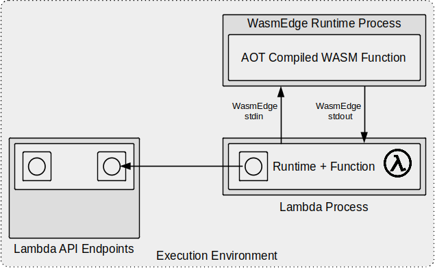

# image-greyscale
This is a Lambda Container Image for a Lambda that implements a filter (written in Rust then compiled to WebAssembly) to convert images to greyscale, it is based on the [WasmEdge](https://wasmedge.org) image processing [example](https://wasmedge.org/book/en/use_cases/frameworks/serverless/aws.html#example-1-image-processing),

The actual image conversion is written in Rust and compiled to [WebAssembly (WASM)](https://webassembly.org/), more precisely [WebAssembly System Interface (WASI)](https://hacks.mozilla.org/2019/03/standardizing-wasi-a-webassembly-system-interface/) using the Rust [wasm32-wasi](https://github.com/bytecodealliance/wasmtime/blob/main/docs/WASI-intro.md) compiler target.

The `.wasm` WebAssembly bytecode generated by compiling the Rust application is itself Ahead of Time (AOT) compiled for  performance, then executed from a Node.js based Lambda using the [WasmEdge](https://wasmedge.org/) WebAssembly runtime.

The fact that the Lambda hosting the WebAssembly function is built using Node.js isn't *especially* significant and just reflects how [the original example](https://wasmedge.org/book/en/use_cases/frameworks/serverless/aws.html#example-1-image-processing) behaved. In practice the WasmEdge runtime is run as a child process with the Lambda request body passed to WasmEdge stdin and the processed image returned on WasmEdge stdout, captured by the Lambda and returned.

Note that there are, in fact, many different ways of hosting the WasmEdge runtime and a more efficient approach would be to embed it as a library in the host application, as spawning a child process for each invocation is relatively expensive. On the other hand, running WasmEdge as a standalone process and communicating via stdio as we do here provides a very high level of isolation should any of the images being processed happen to be malicious.

The overall context of the Lambda Runtime, Lambda Function and WasmEdge runtime process inside the Lambda Execution Environment is:



The Dockerfile looks *relatively* complicated at first glance, but in practice it is quite straightforward.

The first stage compiles the [image-greyscale-rust](image-greyscale-rust) application to WebAssembly, and most of this part of the Dockerfile is really just [installing Rust](https://www.rust-lang.org/tools/install) with the `wasm32-wasi` target:
```
curl --proto '=https' --tlsv1.2 -sSf https://sh.rustup.rs | \
sh -s -- -y --no-modify-path \
--target x86_64-unknown-linux-musl --target wasm32-wasi
```
then compiling the application:
```
cargo build --release --target wasm32-wasi
```
The second stage of the Dockerfile builds the Node.js `aws-lambda-ric` then the Lambda application. This stage is very similar to the [echo-lambda-nodejs](../../echo/echo-lambda-nodejs) Dockerfile, installing Node.js from the [binary archive](https://github.com/nodejs/help/wiki/Installation) then [aws-lambda-ric](https://www.npmjs.com/package/aws-lambda-ric), the AWS Node.js Runtime Interface Client [Open Sourced on GitHub](https://github.com/aws/aws-lambda-nodejs-runtime-interface-client) by AWS.

In addition to installing Node.js and building `aws-lambda-ric`, this stage copies the `image-greyscale.wasm` bytecode built by the first stage and installs `wasmedgec` the AOT bytecode compiler and `wasmedge` the WasmEdge runtime.
```
VERSION=0.8.2 && \
curl -sSL https://github.com/WasmEdge/WasmEdge/releases/download/${VERSION}/WasmEdge-${VERSION}-manylinux2014_x86_64.tar.gz | \
tar -xzv --strip-components 2 WasmEdge-${VERSION}-Linux/bin && \
# AOT Compile WebAssembly bytecode to .so for performance
./wasmedgec --generic-binary image-greyscale.wasm image-greyscale.so && \
# Remove wasmedgec to reduce image size, as it's no longer required
rm wasmedgec && \
```

To build the image:
```
docker build -t image-greyscale-lambda .
```
To run the image-greyscale Lambda container locally (N.B. as provided this script expects a RabbitMQ AMQP broker to be available locally, though it is a configurable setting):
```
image-greyscale-lambda.sh
```
The script is very simple and similar to those used in the echo examples.

## Usage
This Lambda expects requests and responses to be formatted using the AWS API Gateway [Lambda proxy integration syntax](https://docs.aws.amazon.com/apigateway/latest/developerguide/set-up-lambda-proxy-integrations.html#api-gateway-simple-proxy-for-lambda-output-format) e.g.
```
{
  "isBase64Encoded": true|false,
  "statusCode": httpStatusCode,
  "headers": { "headerName": "headerValue", ... },
  "multiValueHeaders": { "headerName": ["headerValue", "headerValue2", ...], ... },
  "body": "..."
}
```
and the request and response `body` field is expected to be hex encoded.

**TODO** proper example clients.

**To invoke the Lambda via curl:**
First we create the request by reading and converting the image to hex in a subshell.

We create a `request.txt` file because curl errors with "Argument list too long" if we attempt to directly use its `-d` option with large items, so we instead do `-d @request.txt`.

We use [xxd](https://linux.die.net/man/1/xxd) to convert to and from hex encoding as follows:
```
xxd -p | tr -d '\n'
```
converts stdin to hex and removes the newlines that xxd includes
```
xxd -r -p
```
converts stdin from hex to binary.

So the following creates a JSON request for the Lambda, with a body that is a hex encoded version of the `cowboy.png` image from the original WasmEdge repository.
```
echo '{"body": "'$(cat cowboy.png | xxd -p | tr -d '\n')'"}' > request.txt
```
Similarly, the following creates a JSON request for the Lambda, with a body that is a hex encoded version of the `savannah_cat.jpg` image
```
echo '{"body": "'$(cat savannah_cat.jpg | xxd -p | tr -d '\n')'"}' > request.txt
```
Given a request.txt we can invoke the Lambda with a generic name:
```
curl -XPOST "http://localhost:8080/2015-03-31/functions/function/invocations" -d @request.txt | grep -Po '"'"body"'"\s*:\s*"\K([^"]*)' | xxd -r -p > output.png
```
or with its proper name (note that this won't work with RIE)
```
curl -XPOST "http://localhost:8080/2015-03-31/functions/image-greyscale-lambda/invocations" -d @request.txt | grep -Po '"'"body"'"\s*:\s*"\K([^"]*)' | xxd -r -p > output.png
```
This example pipes the response via grep to extract the body field using a [grep regex found on stackoverflow](https://stackoverflow.com/questions/1955505/parsing-json-with-unix-tools#comment42500081_1955505). It may be cleaner to use `jq` to extract the body, but most Linux distros don't have that installed by default whereas grep is ubiquitous.

If all is well this should write a greyscale version of the original image as `output.png`.
